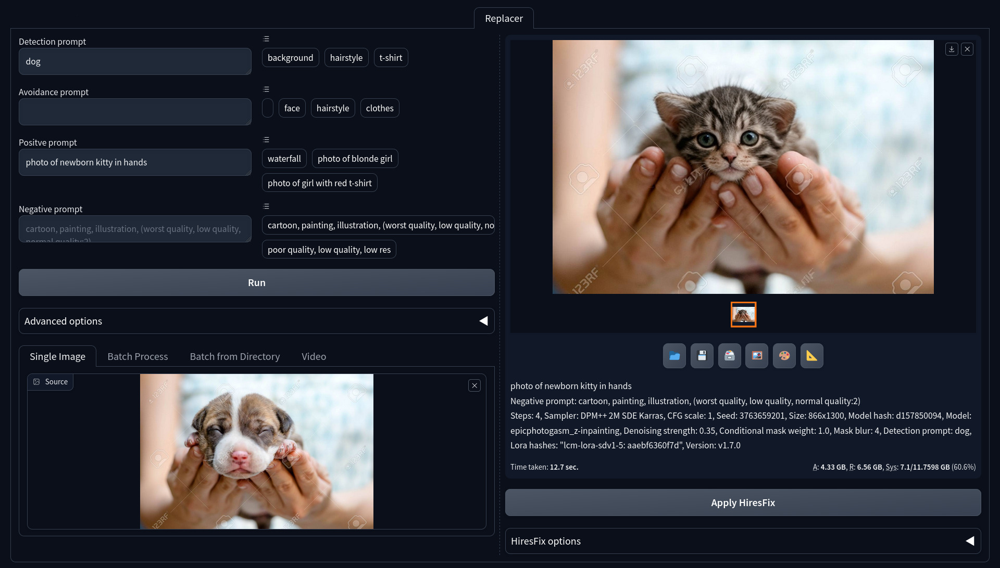
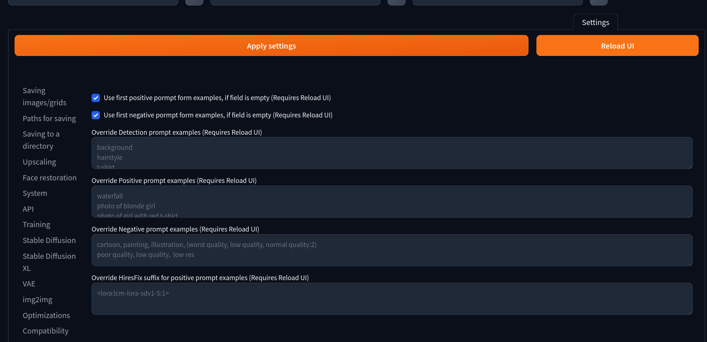
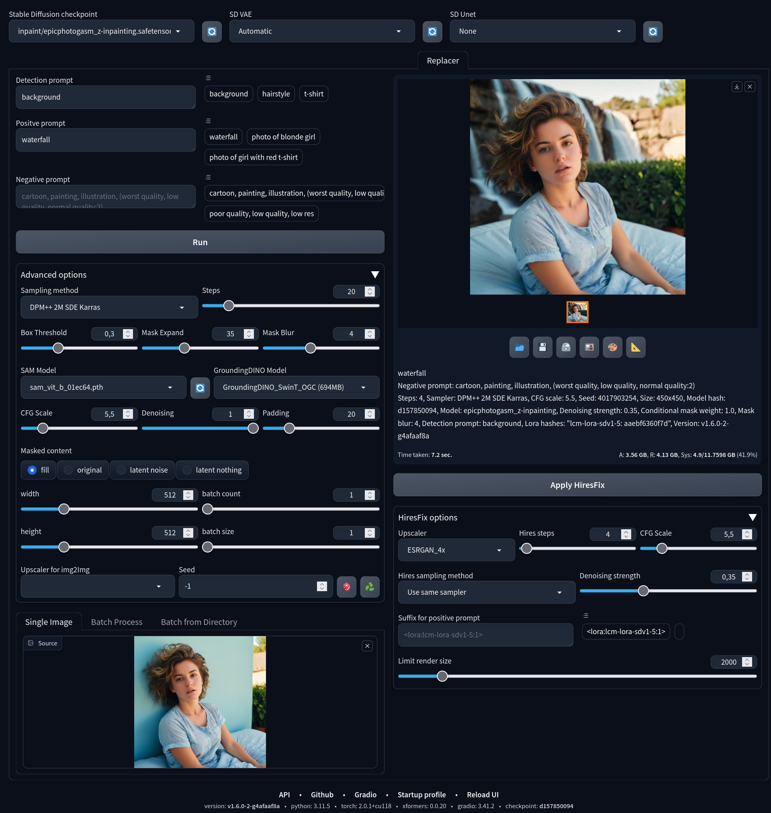
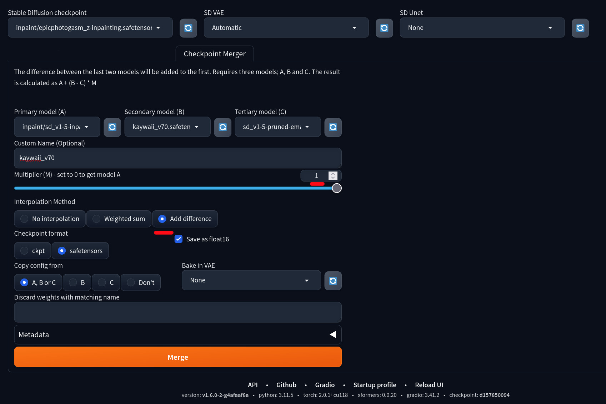

# Replacer

Replacer is an extention for https://github.com/AUTOMATIC1111/stable-diffusion-webui. The goal of this extention is to automate objects masking by detection prompt, using [sd-webui-segment-anything](https://github.com/continue-revolution/sd-webui-segment-anything), and img2img inpainting in one easy to use tab. Aka "Fast Inpaint"




## Installation
1. Install [sd-webui-segment-anything](https://github.com/continue-revolution/sd-webui-segment-anything) extention
2. Put model [sam_hq_vit_l.pth](https://huggingface.co/lkeab/hq-sam/resolve/main/sam_hq_vit_l.pth) (or others) into `extensions/sd-webui-segment-anything/models/sam`
3. _(Optional)_ For faster hires fix, download [lcm-lora-sdv1-5](https://huggingface.co/latent-consistency/lcm-lora-sdv1-5/blob/main/pytorch_lora_weights.safetensors), rename it into `lcm-lora-sdv1-5.safetensors`, put into `models/Lora`
4. Install this extention
5. Reload UI

## Usage
### General
You just need to upload your image, enter 3 prompts, and click "Run". You can override prompts examples in Settings with your commonly using prompts. Don't forget to select inpaint checkpoint

Be sure you are using inpainting model

By default if a prompt is empty, it uses first prompt from examples. You can disable this behavior in settings for positive and negative prompts. Detection prompt can not be empty



### HiresFix

Default settings designed for using lcm lora for fast upscale. It requires lcm lora I mentioned, cfg scale 1.0 and sampling steps 4. There is no difference in quality for my opinion

Despite in txt2img for lcm lora DPM++ samplers produses awful results, while hires fix it produces a way better result. So I recommend to "Use the same sampler" option

### Advanced options

I do not recommend change these options, if you don't know what you do




### Extention name
If you don't like "Replacer" name of this extention, you can override it using envirovment variable `SD_WEBUI_REPLACER_EXTENTION_NAME`

For exaple: Linux
```sh
export SD_WEBUI_REPLACER_EXTENTION_NAME="Fast Inpaint"
```

Or Windows in your `.bat` file:
```bat
set SD_WEBUI_REPLACER_EXTENTION_NAME="Fast Inpaint"
```


## Useful Tips!

### How to change default values of advanced options and hires fix options?


You need to reload the web page, then set your desirable settings. Then go to the "Defaults" section in "Settings" tab. Click "View changes", check is it ok, then click "Apply" and "Reload UI"

### How to get inpainting model?

I recommend to use [EpicPhotoGasm - Z - Inpainting](https://civitai.com/models/132632?modelVersionId=201346) model for realism. If you've already have your favourite model, but it doesn't have inpainting model, you can make it in "Checkpoint Merger" tab:
1. Select your target model as "model B"
2. Select [sd-v1-5-inpainting](https://huggingface.co/webui/stable-diffusion-inpainting/blob/main/sd-v1-5-inpainting.safetensors) as "model A"
3. Select `sd_v1-5-pruned-emaonly` as "model C"
4. Set `Custom Name` the same as your target model name (`.inpainting` suffix will be added automatically)
5. Set `Multiplier (M)` to 1.0
6. Select `Interpolation Method` to "add difference", and "Save as float16"
7. Merge



--------------------------

## Need to do:

- ☑️ cache mask
- ☑️ batch processing
- ☑️ "apply hires fix" button
- ☑️ additional options
- ☑️ progress bar + interrupt
- option for pass into hires fix automatically
- batch get options from png info
- control net
- tiled vae
- ☑️ "hide segment anything extention" option
- txt2img script
- allow multiply instances

### small todo:
- add detection parametres in metadata
- add additional options: include mask or preview, and do exacly steps the slider specifies
- extra mask expand for hires fix
- copy `images` while appling hires fix
- handle empty out dir in batch dir
- turn sam_predict, update_mask into global functions
