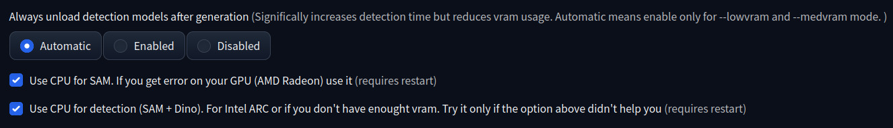
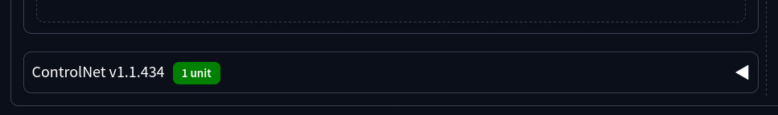

# Replacer

Replacer is an extension for [AUTOMATIC1111/stable-diffusion-webui](https://github.com/AUTOMATIC1111/stable-diffusion-webui). The goal of this extension is to automate objects masking by detection prompt, using [sd-webui-segment-anything](https://github.com/continue-revolution/sd-webui-segment-anything), and img2img inpainting in one easy to use tab. It also useful for batch inpaint, and inpaint in video with stable diffusion and controlnet

> If you find this project useful, please star it on GitHub! ⭐️


You also can draw your mask instead of or in addition to detection, and take advantage of convenient HiresFix option, and ControlNet inpainting with preserving original image resolution and aspect ratio

## Installation
1. Install [sd-webui-segment-anything](https://github.com/continue-revolution/sd-webui-segment-anything) extension. If it bothers you, you can hide it in the Replacer's settings. Go to tab `Extension` -> `Avaliable` -> click `Load from` and search _"sd-webui-segment-anything"_
2. Download model [sam_hq_vit_l.pth](https://huggingface.co/lkeab/hq-sam/resolve/main/sam_hq_vit_l.pth), or others from the list bellow, and put it into `extensions/sd-webui-segment-anything/models/sam`
3. For faster hires fix, download [lcm-lora-sdv1-5](https://huggingface.co/latent-consistency/lcm-lora-sdv1-5/blob/main/pytorch_lora_weights.safetensors), rename it into `lcm-lora-sdv1-5.safetensors`, put into `models/Lora`. Or if you have already lcm lora, then change hires suffix in the extension options
4. Install this extension. Go to tab `Extension` -> `Available` -> click `Load from` and search _"Replacer"_. Be sure your sd-webui version is >= 1.5.0. For AMD and Intel GPUs you need to enable cpu in Replacer's settings
5. Reload UI


### SAM models list:

SAM-HQ are the best for me. Choose it depending on your vram. Sum this model size with dino model size (694MB-938MB)

<blockquote>

1. [SAM](https://github.com/facebookresearch/segment-anything) from Meta AI.
    - [2.56GB sam_vit_h](https://dl.fbaipublicfiles.com/segment_anything/sam_vit_h_4b8939.pth)
    - [1.25GB sam_vit_l](https://dl.fbaipublicfiles.com/segment_anything/sam_vit_l_0b3195.pth)
    - [375MB sam_vit_b](https://dl.fbaipublicfiles.com/segment_anything/sam_vit_b_01ec64.pth)

2. [SAM-HQ](https://github.com/SysCV/sam-hq) from SysCV.
    - [2.57GB sam_hq_vit_h](https://huggingface.co/lkeab/hq-sam/resolve/main/sam_hq_vit_h.pth)
    - [1.25GB sam_hq_vit_l](https://huggingface.co/lkeab/hq-sam/resolve/main/sam_hq_vit_l.pth)
    - [379MB sam_hq_vit_b](https://huggingface.co/lkeab/hq-sam/resolve/main/sam_hq_vit_b.pth)

3. [MobileSAM](https://github.com/ChaoningZhang/MobileSAM) from Kyung Hee University.
    - [39MB mobile_sam](https://github.com/ChaoningZhang/MobileSAM/blob/master/weights/mobile_sam.pt)

</blockquote>

_FastSAM_ and _Matting-Anything_ aren't currently supported

### AMD Radeon and Intel ARC

For AMD and Intel GPUs, and maby something else, you need to enable CPU for detection in Replacer's settings. Go to `Settings` -> `Replacer` and enable it



Then click _"Apply settings"_ and restart webui (do not press _reload ui_, restart it completly)

### Supported extensons:

1. [ControlNet extension](https://github.com/Mikubill/sd-webui-controlnet)


1. My other extension ["Lama cleaner as masked content"](https://github.com/light-and-ray/sd-webui-lama-cleaner-masked-content)


2. [Inpaint Difference](https://github.com/John-WL/sd-webui-inpaint-difference)

3. Fork [sd-webui-forge](https://github.com/lllyasviel/stable-diffusion-webui-forge)

## Usage
### General
You just need to upload your image, enter 3 prompts, and click "Run". You can override prompts examples in Settings with your commonly using prompts. Don't forget to select inpaint checkpoint

Be sure you are using inpainting model

By default if a prompt is empty, it uses first prompt from examples. You can disable this behavior in settings for positive and negative prompts. Detection prompt can not be empty

You can detect few objects, just using comma `,`


### HiresFix

Default settings are designed for using lcm lora for fast upscale. It requires lcm lora I mentioned, cfg scale 1.0 and sampling steps 4. There is no difference in quality for my opinion

Despite in txt2img for lcm lora DPM++ samplers produces awful results, while hires fix it produces a way better result. So I recommend "Use the same sampler" option

Note: hires fix is designed for single-user server

### Advanced options

I do not recommend change these options, if you don't know what you do


### Video inpainting

You can use Replacer to inpaint video with a regular stable diffusion inpaint method. It is very inconsistent, but in a few cases it can produce good enough results

Example:
```
size: 768x512
detection prompt: hands
positive prompt: photo of dog
negative prompt: clothes, cartoon, painting, illustration, (worst quality, low quality, normal quality:2)
denoising: 0.3
masked content: lama cleaner
fps: 10
postprocessed with RIFE
```

**Before:**

https://github.com/light-and-ray/sd-webui-replacer/assets/33491867/a9816404-fea3-4d9d-ac82-81ed596a86f4

**After:**

https://github.com/light-and-ray/sd-webui-replacer/assets/33491867/20a01878-6361-4dc3-a30f-be92ff85dc85

To increase consistency, it's better to inpaint clear objects on video with good quality and enough. Your prompts need to produce consistent results.

To suppress flickering you can generate in little fps (e.g. 10), then interpolate (x2) it with ai interpolation algorithm (e.g [RIFE](https://github.com/megvii-research/ECCV2022-RIFE) or [frame interpolation in deforum sd-webui extension](https://github.com/deforum-art/sd-webui-deforum/wiki/Upscaling-and-Frame-Interpolation))

You can also use [sd-webui-controlnet](https://github.com/Mikubill/sd-webui-controlnet) or [lama-cleaner](https://github.com/light-and-ray/sd-webui-lama-cleaner-masked-content) with (low denosing) extensions to increase consistency, if it fits to your scenario


### Dedicated page
Dedicated page (replacer tab only) is available on url `/replacer-dedicated`


### API
API is avaliable on `/replacer/replace`

```python
    input_image: str = "base64 image"
    detection_prompt: str = ""
    avoidance_prompt: str = ""
    positive_prompt: str = ""
    negative_prompt: str = ""
    width: int = 512
    height: int = 512
    sam_model_name: str = sam_model_list[0] if sam_model_list else ""
    dino_model_name: str = dino_model_list[0]
    seed: int = -1
    sampler: str = "DPM++ 2M SDE Karras"
    steps: int = 20
    box_threshold: float = 0.3
    mask_expand: int = 35
    mask_blur: int = 4
    max_resolution_on_detection = 1280
    cfg_scale: float = 5.5
    denoise: int = 1
    inpaint_padding = 40
    inpainting_mask_invert: bool = False
    upscaler_for_img2img : str = ""
    fix_steps : bool = False
    inpainting_fill : int = 0
    sd_model_checkpoint : str = ""
```

Avaliable options on `/replacer/avaliable_options`

http://127.0.0.1:7860/docs#/default/api_replacer_replace_replacer_replace_post

See an example of usage in [apiExample.py](apiExample.py) script


### Extention name
Replacer" name of this extension, you can provide it inside `ExtensionName.txt` in root of extension directory.

Or you can override it using the environment variable `SD_WEBUI_REPLACER_EXTENTION_NAME`

For exaple: Linux
```sh
export SD_WEBUI_REPLACER_EXTENTION_NAME="Fast Inpaint"
```

Or Windows in your `.bat` file:
```bat
set SD_WEBUI_REPLACER_EXTENTION_NAME="Fast Inpaint"
```

## How it works?

First, grounding dino models detect objects you provided in the detection prompt. Then segment anything model generates contours of them. And then extension chooses randomly 1 of 3 generated masks, and inpaints it with regular inpainting method in a1111 webui

When you press the "Apply hires fix" button, the extension regenerates the image with exactly the same settings, excluding upscaler_for_img2img. Then it applies inpainting with "Original" masked content mode and lower denoising but higher resolution.

## Useful Tips!

### How to change default values of advanced options and hires fix options?


You need to reload the web page, then set your desirable settings. Then go to the "Defaults" section in the "Settings" tab. Click "View changes", check is it ok, then click "Apply" and "Reload UI"

### How to get an inpainting model?

I recommend you to using [EpicPhotoGasm - Z - Inpainting](https://civitai.com/models/132632?modelVersionId=201346) model for realism. If you've already have your favorite model, but it doesn't have inpainting model, you can make it in "Checkpoint Merger" tab:
1. Select your target model as "model B"
2. Select [sd-v1-5-inpainting](https://huggingface.co/webui/stable-diffusion-inpainting/blob/main/sd-v1-5-inpainting.safetensors) as "model A"
3. Select `sd_v1-5-pruned-emaonly` as "model C"
4. Set `Custom Name` the same as your target model name (`.inpainting` suffix will be added automatically)
5. Set `Multiplier (M)` to 1.0
6. Select `Interpolation Method` to "add difference", and "Save as float16"
7. Merge


### How to change maximum values of sliders?

In file `ui-config.json` in root of webui you can edit maximum and minimum values of sliders

--------------------------

## Need to do:

- ☑️ cache mask
- ☑️ batch processing
- ☑️ "apply hires fix" button
- ☑️ additional options
- ☑️ progress bar + interrupt
- option for pass into hires fix automatically
- ☑️ control net
- tiled vae
- ☑️ "hide segment anything extention" option
- txt2img script
- allow multiply instances

### small todo:
- copy `images` while appling hires fix
